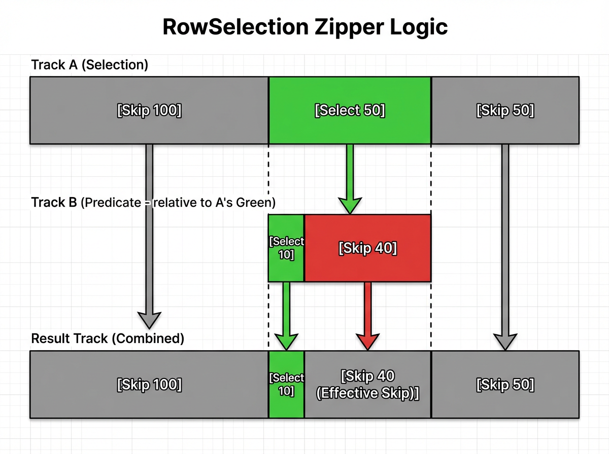
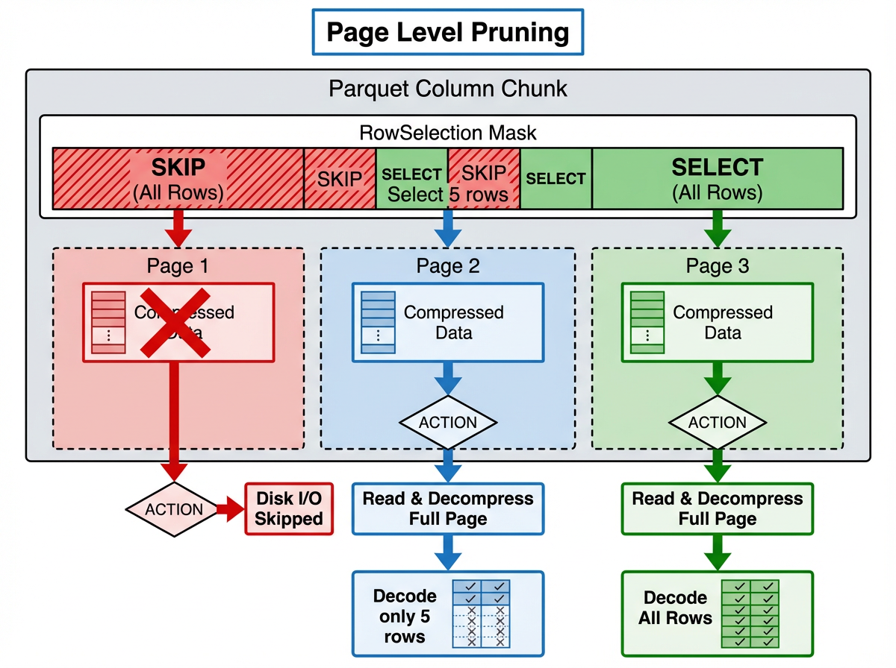
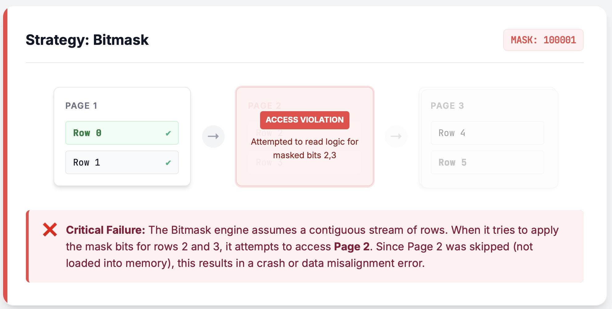
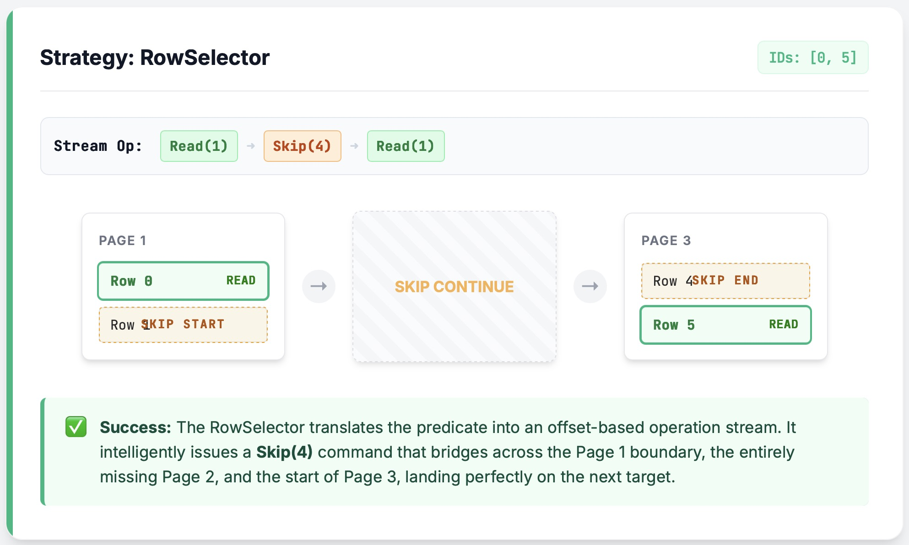

# A Practical Dive Into Late Materialization in arrow-rs Parquet Reads

This is a article about decisions, potholes, and exact code spots that make `arrow-rs` behave like a tiny query engine when it reads Parquet with late materialization.

## 1. Why Late Materialization

Columnar reads are a fight between **I/O bandwidth** and **CPU decode**. Skipping is great, but skipping also has a cost. The goal in `arrow-rs` is **pipeline-style late materialization**: evaluate predicates first, then touch projected columns, and keep the pipeline tight at the page level so we do minimal reads and minimal decode work.

Borrowing Abadi's classification from his [paper](https://www.cs.umd.edu/~abadi/papers/abadiicde2007.pdf), the target is **LM-pipelined**: interleave predicates and data columns instead of creating a big "materialize everything" barrier.

Take `SELECT B, C FROM table WHERE A > 10 AND B < 5` as the running example:
1. Read column `A`, build a `RowSelection` (a sparse mask), and get the first cut of rows.
2. Use that `RowSelection` to read column `B`, decode-and-filter on the fly, and make the selection even sparser.
3. Use the refined `RowSelection` to read column `C` (a projection column), decoding only the surviving rows.

The rest of the post zooms into how the code makes that path work.

---

## 2. Key Mechanics

This section walks through the pipeline of "plan → select → read → cache": how we shrink the row set step by step, how `RowSelection` does boolean algebra, and how caching plus zero-copy keep decode overhead low.
git
### 2.1 LM-pipelined

"LM-pipelined" sounds academic; in `arrow-rs` it simply means **a pipeline that runs "read predicate column → generate row selection → read data column" in sequence** instead of "read every predicate column up front."

Key actors:
- **ReadPlan / ReadPlanBuilder**: encode "which columns to read and with what row subset" into a plan. It does not pre-read all predicate columns. It reads one, tightens the selection, then moves on.
- **RowSelection**: describes "skip/select N rows" via RLE (`RowSelector::select/skip`) or a bitmask. This is the currency that carries sparsity through the pipeline.
- **ArrayReader**: the component that does I/O and decode. It receives a `RowSelection` and decides which pages to read and which values to decode.

Starting from [v57.1.0](https://github.com/apache/arrow-rs/tree/57.1.0), `RowSelection` can switch between RLE (selectors) and bitmask. Bitmasks are faster when gaps are tiny and sparsity is high; RLE is friendlier to page-level skips. Details show up again in 3.3.

**Execution sketch** (`SELECT * FROM table WHERE A > 10 AND B < 5`):
1. **Initial**: `selection = None` (equivalent to "select all").
2. **Read A**: `ArrayReader` decodes column A in batches; the predicate builds a mask; `RowSelection::from_filters` turns it into a sparse selection.
3. **Tighten**: `ReadPlanBuilder::with_predicate` chains the new mask via `RowSelection::and_then`.
4. **Read B**: build column B's reader with the current `selection`; the reader only performs I/O and decode for selected rows and produces a sparser mask.
5. **Merge**: `selection = selection.and_then(selection_b)`; projection columns now decode a tiny row set.

**Code landing spots and sketch**:

```rust
// Close to the flow in read_plan.rs (simplified)
let mut builder = ReadPlanBuilder::new(batch_size);
// 1) Inject external pruning (e.g. Page Index):
builder = builder.with_selection(page_index_selection);
// 2) Append predicates serially:
for predicate in predicates {
    builder = builder.with_predicate(predicate); // internally uses RowSelection::and_then
}
// 3) Build readers; all ArrayReaders share selection
let plan = builder.build();
let reader = ParquetRecordBatchReader::new(array_reader, plan);
```


Once the pipeline exists, the next question is **how to represent and combine these sparse selections**, which is where `RowSelection` comes in.

### 2.2 Logical ops on row selectors (`RowSelection::and_then`)

`RowSelection`—defined in `selection.rs`—is the token that every stage passes around. It uses RLE (`RowSelector::select/skip(len)`) to describe sparse ranges. `and_then` is the core operator for "apply one selection to another": left-hand side is "rows already allowed," right-hand side further filters those rows, and the output is their boolean AND.

**Walkthrough**:

*   **Input Selection A (already filtered)**: `[Skip 100, Select 50, Skip 50]` (physical rows 100-150 are selected)
*   **Input Predicate B (filters within A)**: `[Select 10, Skip 40]` (within the 50 selected rows, only the first 10 survive B)

**How it runs**:
Traverse both lists at once, zipper-style:
1.  **First 100 rows**: A is Skip → result is Skip 100.
2.  **Next 50 rows**: A is Select. Look at B:
    *   B's first 10 are Select → result Select 10.
    *   B's remaining 40 are Skip → result Skip 40.
3.  **Final 50 rows**: A is Skip → result Skip 50.

**Result**: `[Skip 100, Select 10, Skip 90]`.

This keeps narrowing the filter while touching only lightweight metadata—no data copies. The implementation is a two-pointer linear scan; complexity is linear in selector segments. The sooner predicates shrink the selection, the cheaper later scans become.



### 2.3 Smart caching

Late materialization means the same column often plays both predicate and projection. Without caching, column `B` would be decoded once for filtering and again for projection—wasting I/O and CPU. `CachedArrayReader` keeps it simple: **stash the batch the first time you decode it, reuse it next time.**

Why two cache layers? One cache should be **shareable**; another should **guarantee self-use**. The common case: column B is read during predicates, then read again during projection. If projection hits the Shared Cache, it can reuse the decoded Arrow array. The Shared Cache might evict entries (capacity limits or other readers), so a Local Cache is the safety net—if the shared entry is gone, you can still read your own batch or fall back to re-decode. Correctness is never at risk; only performance varies.

Scope is intentionally narrow: the Shared Cache lives only within a single row group and resets between groups so we do not pin 100MB forever. Batch IDs are also row-group local (`row_offset / batch_size`), so predicate and projection batches naturally align.

To keep memory spiky instead of staircase-shaped, caches have a size cap and evict older batches; consumers also drop earlier batches after they are consumed. 

### 2.4 Zero-copy

One of the common costs in Parquet decode is "decode into a Vec, then memcpy into an Arrow buffer." Fixed-width types suffer most: same layout, same size, but still copied. `PrimitiveArrayReader` fixes this with zero-copy on the fixed-width path: it hands ownership of the decoded `Vec<T>` directly to an Arrow `Buffer`, skipping memcpy. Numeric columns finish decode with almost no tail cost.

---

## 3. Engineering challenges and fixes

### 3.1 The alignment gauntlet

In chained filtering, every operator uses a different coordinate system. The "first row" in filter N might be the "row 10,001" of the file.
*   **Fix**: Every `RowSelection` operation (`split_off`, `and_then`, `trim`) has fuzz-level tests to guarantee exact translation between relative and absolute offsets under any Skip/Select pattern. Correctness here decides whether readers stay stable under the triple stress of batch boundaries, sparse selections, and page pruning.

```rust
// Example: trim the first 100 rows, then take 10 rows within the trimmed window
let a: RowSelection = vec![RowSelector::skip(100), RowSelector::select(50)].into();
let b: RowSelection = vec![RowSelector::select(10), RowSelector::skip(40)].into();
let result = a.and_then(&b);
assert_eq!(
    Vec::<RowSelector>::from(result),
    vec![RowSelector::skip(100), RowSelector::select(10), RowSelector::skip(40)]
);
```

### 3.2 Page-level I/O pruning

Skipping decode does not equal skipping I/O. High performance means **do not issue a disk read at all**. Parquet data is compressed per page; we use the offset index plus `RowSelection::scan_ranges` to decide which pages never get read.
* **Challenge**: If `RowSelection` touches even one row in a page, the whole page must be read and decompressed; only when the page is fully skipped can we avoid I/O.
* **Implementation**: `scan_ranges` uses each page's `first_row_index` and `compressed_page_size` to compute which page ranges are completely skipped and returns the `(offset, length)` list for the reads we must issue. Decode then uses `skip_records` to skip rows inside the page.
* **Fallback**: If the file lacks an offset index or the selection is too fragmented to skip entire pages, the reader gracefully falls back to "read whole pages and skip rows during decode"—correctness first, optimal I/O second.

```rust
// Example: two pages; page0 covers 0..100, page1 covers 100..200
let locations = vec![
    PageLocation { offset: 0, compressed_page_size: 10, first_row_index: 0 },
    PageLocation { offset: 10, compressed_page_size: 10, first_row_index: 100 },
];
// RowSelection only keeps 150..160; page0 fully skipped, page1 must be read
let sel: RowSelection = vec![
    RowSelector::skip(150),
    RowSelector::select(10),
    RowSelector::skip(40),
].into();
let ranges = sel.scan_ranges(&locations);
assert_eq!(ranges.len(), 1); // only request page1
```



### 3.3 Adaptive RowSelection policy (bitmask vs. RLE)

Sparse selections under late materialization create two extremes:
- **Ultra sparse** (e.g., take 1 row every 10,000): bitmask wastes memory (1 bit per row) while RLE needs just a few selectors.
- **Sparse with tiny gaps** (e.g., "read 1, skip 1" repeatedly): RLE makes the decoder fire constantly; bitmask wins.

Instead of a global strategy, we use adaptive strategy:
* Compare the average selection length against a threshold (currently 32). Small total rows with many selectors lean toward bitmask (sparse but choppy); otherwise selectors (RLE) win.
* **Safety override**: Bitmask plus page pruning can produce "missing page" panics because the mask might try to filter rows from pages never read. The `RowSelection` detects this and forces RLE so the necessary pages are read before skipping rows. (see 3.3.2)

#### 3.3.1 Threshold and benchmarks
The threshold 32 comes from benchmarks across multiple distributions (even spacing, exponential sparsity, random sparsity) and column types. It separates "choppy but dense" from "long skip regions" well. Future heuristics may incorporate data types and distributions for finer tuning.

A performance comparison between row selection and bitmask: the vertical axis is the time for select (lower means better performance), and the horizontal axis represents the average length of the selection. You can see the performance curves cross at around 32.


```rust
// Auto prefers bitmask, but page pruning forces a switch back to RLE
let policy = RowSelectionPolicy::Auto { threshold: 32 };
let plan_builder = ReadPlanBuilder::new(1024).with_row_selection_policy(policy);
let plan_builder = override_selector_strategy_if_needed(
    plan_builder,
    &projection_mask,
    Some(offset_index), // page index enables page pruning
);
assert_eq!(plan_builder.row_selection_policy(), &RowSelectionPolicy::Selectors);
```

#### 3.3.2 The bitmask trap: missing pages
The bitmask introduces a new failure mode. Consider a simple example:

Only the first and last rows match the predicate; the four middle rows are skipped. The file stores two rows per page, so the middle page is fully pruned. With a bitmask, the reader still attempts to load all pages before applying the mask. When it discovers that the middle page is missing, it panics.

The fix is the fallback above: detect "bitmask + possible page skips," force RLE selectors, and let `skip_records` safely skip rows after the required pages are read.

The diagrams below compare the failing "bitmask + page pruning" path with the safe "selector" path.





---

## 4. Wrap-up

The Parquet reader in `arrow-rs` is more than a format parser—it is a **mini query engine**. Techniques like predicate pushdown and late materialization are embedded right in the file reader. With `ReadPlanBuilder` orchestrating a cascading plan and `RowSelection` keeping precise control, the reader avoids decompressing and decoding data you do not need, while keeping correctness intact.
